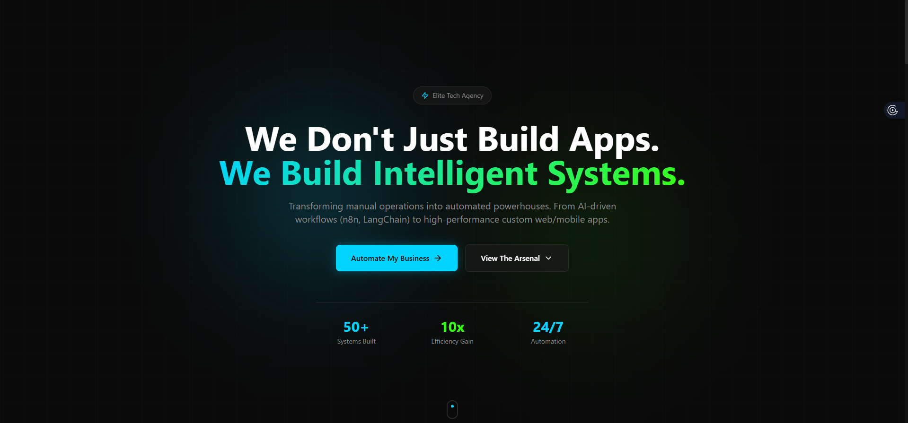

# CREAGEN - Marketing Data Automation Portfolio

A high-converting, single-page portfolio website for a Marketing Data Automation Engineer. Built with Next.js 14, React, Tailwind CSS, and Framer Motion featuring a dark cyber-tactical theme.



## 🚀 Live Demo

**[View Live Site →](#)** *(Deploy to Vercel/Netlify and add link)*

## ✨ Features

### Sections
- **Hero** - Eye-catching headline with animated background and CTAs
- **Meet The Architect** - Profile section with bio, LinkedIn CTA, experience timeline, and core skills
- **Services** - Glassmorphism cards showcasing automation services
- **Live Engineering** - Real-time GitHub repositories fetched via API with fallback support
- **Scalable Solutions** - Outcome-driven pricing tiers (prices hidden, focus on value)
- **Tech Stack Arsenal** - Infinite scrolling marquee with brand logos
- **Footer** - Final CTA with social links and copyright

### Technical Highlights
- ⚡ **Next.js 14** with App Router
- 🎨 **Dark Cyber-Tactical Theme** - Deep blacks, electric blue & neon green accents
- 🌊 **Framer Motion** animations - Staggered reveals, infinite marquees, hover effects
- 🔗 **GitHub API Integration** - Live repo fetching with intelligent fallback
- 📱 **Fully Responsive** - Mobile-first design
- 🎯 **Glassmorphism UI** - Modern frosted-glass aesthetic
- ⚠️ **Error Handling** - Graceful fallbacks for API failures

## 🛠 Tech Stack

- **Framework:** Next.js 14.2.x (App Router)
- **Language:** TypeScript
- **Styling:** Tailwind CSS 3.4.x
- **Animations:** Framer Motion
- **Icons:** Lucide React
- **API:** GitHub REST API

## 📦 Installation

```bash
# Clone the repository
git clone https://github.com/haikalmol/creagen-agency.git

# Navigate to project
cd creagen-agency

# Install dependencies
npm install

# Run development server
npm run dev

# Open http://localhost:3000
```

## 🎨 Customization

### Profile Section
Edit `src/components/Architect.tsx`:
- Update profile image: Place your photo in `public/img/` and update the `src` path
- Modify bio text
- Update LinkedIn URL
- Adjust skills/experience timeline

### GitHub Integration
The Live Engineering section auto-fetches from:
```
https://api.github.com/users/haikalmol/repos?sort=updated&per_page=3
```

To change the username, edit `src/components/LiveGithubRepos.tsx` line 45.

### Tech Stack Logos
Add logo images to `public/img/` with these filenames:
- `n8n-logo.png`
- `aws-logo.png`
- `meta-logo.png`
- `openai-logo.png`
- `claude-logo.png`
- `nextjs-logo.png`
- `nodejs-logo.png`
- `python-logo.png`
- `tailwind-logo.png`
- `reactnative-logo.png`
- `figma-logo.png`
- `langchain-logo.png`
- `openclaw-logo.png`

### Colors & Theme
Edit `tailwind.config.ts` to customize:
```typescript
colors: {
  tactical: {
    black: "#0a0a0a",
    dark: "#111111",
    light: "#1a1a1a",
    electric: "#00d4ff",
    neon: "#39ff14",
    muted: "#888888",
  }
}
```

## 🚀 Deployment

### Vercel (Recommended)
```bash
npm install -g vercel
vercel
```

### Netlify
```bash
npm run build
# Drag 'dist' folder to Netlify or use CLI
```

### Static Export
```bash
npm run build
# Output in 'dist' folder
```

## 📁 Project Structure

```
├── src/
│   ├── app/
│   │   ├── globals.css      # Global styles & Tailwind
│   │   ├── layout.tsx       # Root layout
│   │   └── page.tsx         # Main landing page
│   ├── components/
│   │   ├── Hero.tsx
│   │   ├── Architect.tsx    # Profile section
│   │   ├── Services.tsx
│   │   ├── LiveGithubRepos.tsx  # GitHub API integration
│   │   ├── Packages.tsx     # Pricing tiers
│   │   ├── TechStack.tsx    # Infinite logo marquee
│   │   └── Footer.tsx
│   └── images.d.ts          # Type declarations
├── public/
│   └── img/                 # Images & logos
├── tailwind.config.ts
├── next.config.mjs
└── package.json
```

## 📝 Environment Variables

No environment variables required for basic setup. For advanced features:

```env
# Optional: GitHub Token for higher rate limits
GITHUB_TOKEN=your_token_here
```

## 🐛 Troubleshooting

### Images not loading
- Ensure images are in `public/img/` folder
- Use root-relative paths: `/img/filename.png`

### Build errors on Windows
If you encounter ESM/PostCSS errors:
```bash
rm -rf .next
npm install next@14.2.28 postcss@8.5.3 autoprefixer@10.4.21
npm run dev
```

### GitHub API rate limit
The component automatically falls back to dummy data when rate limited (60 requests/hour for unauthenticated requests).

## 📄 License

MIT License - feel free to use this template for your own portfolio.

## 🤝 Connect

- LinkedIn: [Haikal Fairuzi Maulana](https://www.linkedin.com/in/haikal-fairuzi-maulana-4227ab213/)
- GitHub: [@haikalmol](https://github.com/haikalmol)

---

**Engineered for Automation.** ⚡
